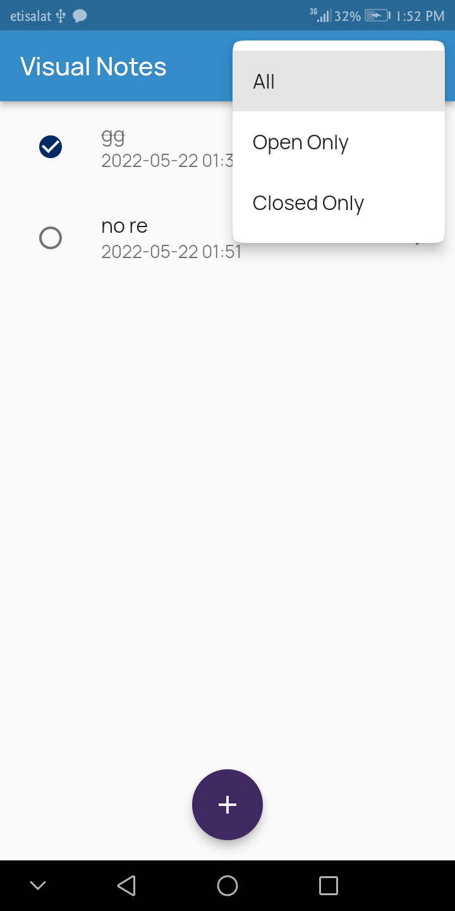
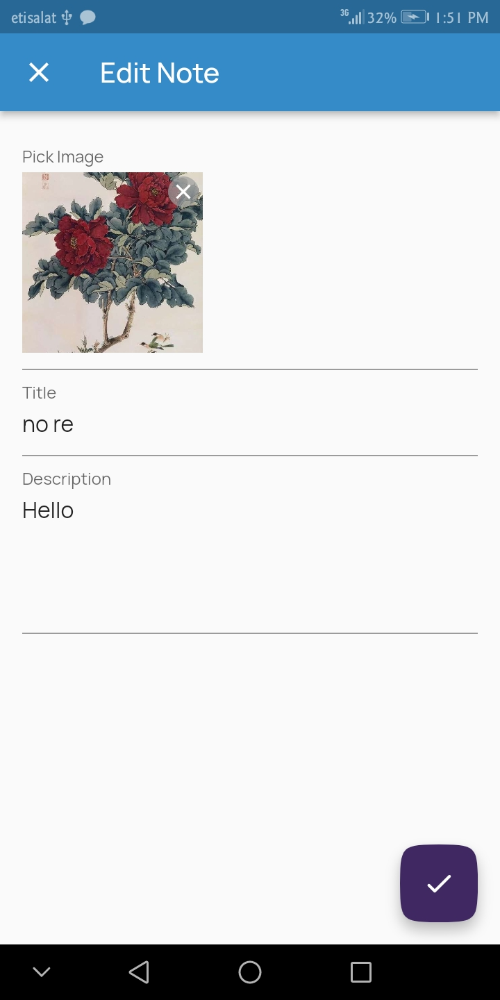
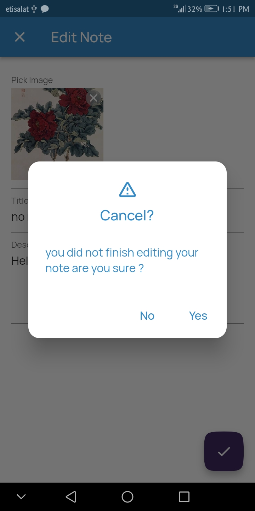
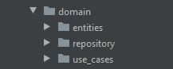
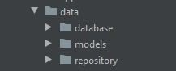
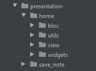

# Visual Notes :notebook_with_decorative_cover:
# Description :pencil2:
 Notes App with Bloc and Clean Architecture:
 - add/ edit/ delete/ update operations
 - each note has its [id, title, description, photo, date, status (open, closed)]
 - you can choose photo source (gellary / camera)
 - display filter depndeing on note status
 - using bloc for state management
 - floor database for local storage
 - implemented with the clean architicture Principle https://blog.cleancoder.com/uncle-bob/2012/08/13/the-clean-architecture.html
 - using S.O.L.I.D. Principles and Dependency injection for maintainability https://en.wikipedia.org/wiki/SOLID
 - project created using very_good_cli package
 
  &nbsp;
  &nbsp;
  &nbsp;
  &nbsp;

# Project Structure :gear:

<figure>
 <figcaption>Domain Folder</figcaption>
 
</figure>

<figure>
 <figcaption>Data Folder</figcaption>
 
</figure>

<figure>
 <figcaption>Presentation Folder</figcaption>
 
</figure>

# Main Used Packages :hammer_and_wrench:
- floor database: https://pub.dev/packages/floor
- flutter form builder: https://pub.dev/packages/flutter_form_builder
- form builder image picker: https://pub.dev/packages/form_builder_image_picker
- form builder validators: https://pub.dev/packages/form_builder_validators
- freezed: https://pub.dev/packages/freezed
- bloc: https://pub.dev/packages/bloc
- get_it: https://pub.dev/packages/get_it
- very good cli: https://pub.dev/packages/very_good_cli
